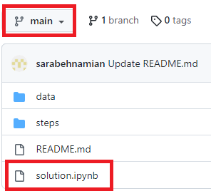
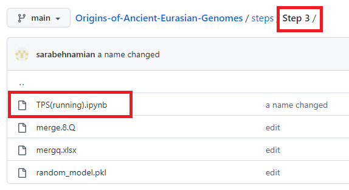

# Origins of Ancient Eurasian Genomes
We presented the Temporal Population Structure (TPS), the first genomic dating machine learning-based method for ancient genomes ranging from the fringes of the Late Mesolithic to modern times. Many published ancient genomes lack reliable and direct dates, which results in obscure and contradictory reports. Here, we developed TPS, the first DNA-based dating method for ancient genomes ranging from the Late Mesolithic to modern-days, and applied it to 3,591 ancient and 1,307 modern Eurasians. We show that TPS predictions align with their known dates and correctly account for kin relationships. TPS can be used when radiocarbon dating is unfeasible or uncertain or to develop alternative hypotheses for samples younger than 10,000 years ago, a limitation that may be resolved over time as ancient data accumulate. Overall, TPS is a novel tool in the paleogenomic toolbox that can improve the accuracy of archeological and paleogenomic studies.  
`If you want to see how the main code was implemented or reconstruct the calculations, you can view solution. ipynb. The Jupyter file contains both our codes and explanations (markdowns).`




`Please follow these steps if you want the pipeline to run on new datasets with examples of inputs and outputs. `

```
STEP0 - Converting genotype file
STEP1 - Merging your file with the temporal components
STEP2 - Calculating the temporal components of your samples
STEP3 - Predicting 'merge.8.Q' data file
```


[](explanation.mov)